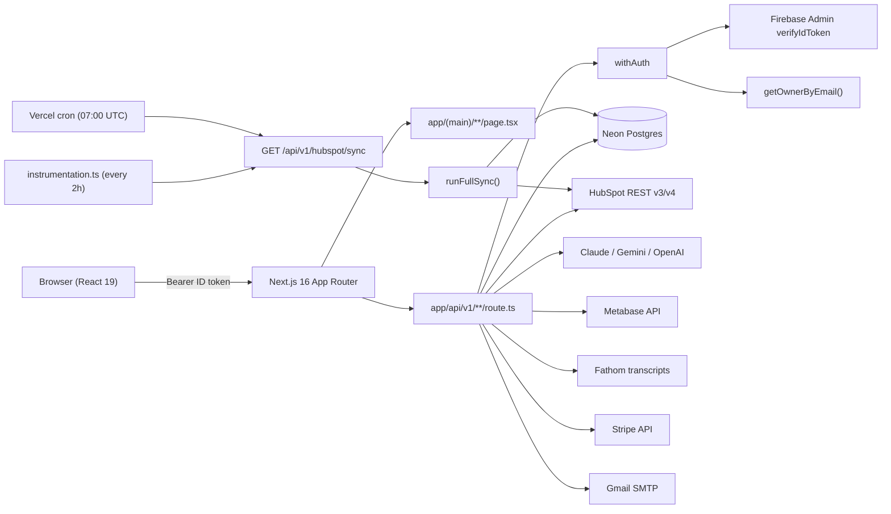
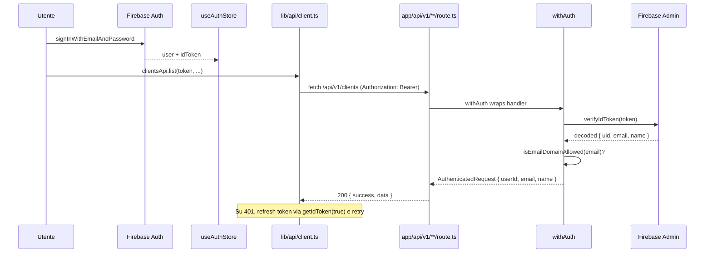

# spoki-post-sales -- Architecture & Playbook

Documento di riferimento architetturale per agenti AI (Cursor, Claude Code, Codex, ecc.) e per nuovi contributor umani. Pensato per essere parsato e citato a tratti: ogni sezione e' autonoma, ogni file menzionato e' linkato.

Per il quick context sempre-caricato vedi `.cursor/rules/spoki-post-sales-map.mdc`. Per il setup locale vedi [`README.md`](README.md). Per l'onboarding guidato (Giulio) vedi [`START-HERE.md`](START-HERE.md).

---

## 1. Contesto business

`spoki-post-sales` e' la **dashboard interna del reparto Customer Success di Spoki**. Aggrega in un'unica UI:

- Anagrafica clienti (companies HubSpot) con health score, plan, MRR, owner CS, fase di onboarding.
- Ticket di supporto e onboarding (HubSpot pipelines).
- Engagement (call/email/meeting) sincronizzati da HubSpot.
- Deal Sales e Upselling con stage corrente e giorni-in-stage.
- Goals cliente estratti via AI dalle call (Fathom + Claude/Gemini).
- Quarterly Business Review (QBR) generati con AI e inviati via email.
- Churn tracker, alert rules, task, report di team/training.
- Dashboard finanziarie (MRR/NRR/GRR/Pareto/forecast) lette da Metabase.

L'app **non e' una source of truth**: i dati canonici stanno in HubSpot e Stripe; Postgres e' la cache locale sincronizzata via cron.

---

## 2. Stack & vincoli versione

- **Next.js 16** (App Router, bundler webpack -- NON Turbopack). Breaking changes vs i dati di training di molti LLM: leggi `node_modules/next/dist/docs/` prima di toccare API Next.js. Nota in [`AGENTS.md`](AGENTS.md).
- **React 19** (Server Components di default, `'use client'` quando servono hook).
- **TypeScript 5** strict.
- **Tailwind CSS 4** + `@tailwindcss/postcss`, `tailwind-merge`, `clsx` (helper `cn` in [`src/lib/utils/cn.ts`](src/lib/utils/cn.ts)).
- **PostgreSQL** (Neon hosted) via driver `pg`.
- **Firebase Auth** (client + admin SDK).
- **Zustand** per stato globale frontend (solo auth: `user`, `token`, `loading`).
- **Recharts** per grafici, **lucide-react** per icone, **@dnd-kit** per Kanban drag&drop, **jsPDF** per export QBR.
- **AI**: Anthropic Claude (default `claude-sonnet-4-20250514`), Google Gemini (`gemini-2.5-flash`), OpenAI (`gpt-4o-mini` per account-brief).

---

## 3. Diagramma runtime



---

## 4. Mappa file-system commentata

### `src/app/`

- [`layout.tsx`](src/app/layout.tsx) -- root layout (font, `globals.css`).
- [`page.tsx`](src/app/page.tsx) -- redirect a `/login` o `/dashboard`.
- [`(auth)/login/`](src/app/(auth)/login) -- pagina login Firebase (client component, scrive su `useAuthStore`).
- [`(main)/layout.tsx`](src/app/(main)/layout.tsx) -- layout autenticato: hydratazione Firebase, redirect a `/login` se `!user`, monta `<Sidebar />` e `<AiChatPanel />`.
- [`(main)/dashboard`](src/app/(main)/dashboard), [`clients`](src/app/(main)/clients), [`customer-success`](src/app/(main)/customer-success), [`onboarding-hub`](src/app/(main)/onboarding-hub), [`reports`](src/app/(main)/reports), [`tasks`](src/app/(main)/tasks), [`alerts`](src/app/(main)/alerts), [`churn-tracker`](src/app/(main)/churn-tracker), [`admin`](src/app/(main)/admin) -- una cartella per sezione di sidebar.
- [`api/v1/`](src/app/api/v1) -- vedi sezione "API surface".

### `src/components/`

- [`auth/`](src/components/auth) -- form login.
- [`layout/Sidebar.tsx`](src/components/layout/Sidebar.tsx) -- nav principale, voci nascoste/mostrate via `isAdminEmail` / `isCustomerSuccessTeamMember`.
- [`clients/`](src/components/clients) -- tabella e dettaglio cliente.
- [`customer-success/`](src/components/customer-success), [`onboarding-hub/`](src/components/onboarding-hub) -- Kanban board (dnd-kit).
- [`dashboard/`](src/components/dashboard) -- card metriche, grafici Recharts.
- [`reports/`](src/components/reports) -- team-reports e training-reports (call analysis).
- [`ui/`](src/components/ui) -- primitivi riusabili: `Card`, `Badge`, `HealthBadge`, `OnboardingStageBadge`, `SyncButton`, `WorkflowEnrollModal`, `EmailGeneratorModal`, `QbrModal`, `AiChatPanel`.

### `src/lib/`

- [`api/middleware.ts`](src/lib/api/middleware.ts) -- `withAuth`, `verifyCronRequest`, `ApiError`, `createSuccessResponse`, `createErrorResponse`.
- [`api/client.ts`](src/lib/api/client.ts) -- typed fetch client con auto-refresh del token su 401. Esporta gruppi: `clientsApi`, `aiApi`, `dashboardApi`, `tasksApi`, `alertsApi`, `qbrApi`, `hubspotApi`, ecc.
- [`config/index.ts`](src/lib/config/index.ts) -- lettura tipata delle env (`config.firebase`, `config.postgres`, `config.hubspot`, `config.metabase`, `config.stripe`, `config.gmail`, `config.googleChat`, `config.cron`, `config.devLogin`, `config.app`, `config.auth`).
- [`config/owners.ts`](src/lib/config/owners.ts) -- mappa HubSpot owner ID -> `{ name, email, team, isAdmin }`. Helper: `getOwnerByEmail`, `isAdminEmail`, `isCustomerSuccessTeamMember`.
- [`config/deal-pipelines.ts`](src/lib/config/deal-pipelines.ts) -- pipeline Sales `671838099` e Upselling `2683002088`, helper `getStageLabel`, `getStageConfig`, `getPipelineLabel`, `getTotalStages`.
- [`config/onboarding-pipeline.ts`](src/lib/config/onboarding-pipeline.ts) -- ID stage onboarding HubSpot.
- [`config/hubspot-props.ts`](src/lib/config/hubspot-props.ts) -- nomi delle property HubSpot da leggere/scrivere.
- [`config/workflows.ts`](src/lib/config/workflows.ts) -- workflow ID enrollabili.
- [`config/cs-pipeline.ts`](src/lib/config/cs-pipeline.ts), [`config/cs-hubspot-dashboards.ts`](src/lib/config/cs-hubspot-dashboards.ts), [`config/pipelines.ts`](src/lib/config/pipelines.ts) -- config CS.
- [`db/postgres.ts`](src/lib/db/postgres.ts) -- pool con auto-recycle ogni 5 min, retry su connection error, `statement_timeout` 30s. Esporta `pgQuery<T>(sql, params)`.
- [`db/migrations/`](src/lib/db/migrations) -- SQL idempotenti `001`-`015`.
- [`hubspot/client.ts`](src/lib/hubspot/client.ts) -- wrapper REST HubSpot (companies, contacts, tickets, engagements, deals, workflows v2/v4, owners). Singleton `getHubSpotClient()`.
- [`hubspot/sync.ts`](src/lib/hubspot/sync.ts) -- `runFullSync()` orchestratore + funzioni `syncCompaniesOnly`, `syncContactsOnly`, `syncTicketsOnly`, `syncEngagementsOnly`, `syncDealsOnly`.
- [`firebase/client.ts`](src/lib/firebase/client.ts) -- `getFirebaseAuth()` (singleton SDK browser).
- [`firebase/admin.ts`](src/lib/firebase/admin.ts) -- `verifyIdToken()` (Admin SDK server-side, init da `FIREBASE_SERVICE_ACCOUNT_BASE64` o triple `FIREBASE_PROJECT_ID/CLIENT_EMAIL/PRIVATE_KEY`).
- [`store/auth.ts`](src/lib/store/auth.ts) -- Zustand store: `user`, `token`, `loading`, `setUser`, `setToken`, `setLoading`, `signOut`.
- [`services/`](src/lib/services) -- vedi sezione "Servizi AI & integrazioni".
- [`account-brief/`](src/lib/account-brief) -- `build-context.ts` + `generate.ts` + `usage-nps.ts`: brief AI account.
- [`onboarding/`](src/lib/onboarding), [`customer-success/`](src/lib/customer-success), [`health-score/`](src/lib/health-score) -- logica di dominio.
- [`integrations/`](src/lib/integrations) -- adapter generici.
- [`utils/`](src/lib/utils) -- `cn`, `domain-validation`, ecc.
- [`logger.ts`](src/lib/logger.ts) -- `getLogger(scope)` con prefisso strutturato.
- [`format/`](src/lib/format) -- formattatori (currency, dates).
- [`supabase/`](src/lib/supabase) -- client Supabase (uso residuo, vedi `@supabase/supabase-js` in `package.json`).

### `src/types/`

- [`index.ts`](src/types/index.ts) -- tipi di dominio: `Client`, `ClientWithHealth`, `DealSummary`, `ClientDeal`, `ClientGoal`, `Ticket`, `Engagement`, `Contact`, `Task`, `OnboardingProgress`, `OnboardingTemplate`, `Alert`, `AlertRule`, `Workflow`, `PaginatedResponse<T>`, `ApiResponse<T>`, `AccountBriefPayload`.
- [`dashboard.ts`](src/types/dashboard.ts) -- DTO Metabase.
- [`churn.ts`](src/types/churn.ts) -- churn tracker.

### Root

- [`scripts/migrate.mjs`](scripts/migrate.mjs) -- esegue `.sql` in ordine alfabetico, legge `DATABASE_URL` da `.env.local`.
- [`scripts/sync-cron.mjs`](scripts/sync-cron.mjs) -- trigger sync da CLI.
- [`scripts/backfill-transcripts.mjs`](scripts/backfill-transcripts.mjs) -- one-shot backfill transcript Fathom.
- [`src/instrumentation.ts`](src/instrumentation.ts) -- runtime hook Next.js: schedula `runSync` ogni 2h chiamando il proprio endpoint via fetch.
- [`vercel.json`](vercel.json) -- region `fra1`, cron giornaliero, `maxDuration` per family.
- [`.env.example`](.env.example) -- vedi sezione "Env vars".

---

## 5. Auth flow



Dettagli:

- Token in header `Authorization: Bearer <idToken>`.
- Bypass dev: token che inizia con `dev-user-` accettato solo se `ENABLE_DEV_LOGIN=true` e `NODE_ENV !== 'production'`.
- Dominio email: `ALLOWED_EMAIL_DOMAINS` (CSV); vuoto = tutti accettati.
- Owner mapping in route: `const owner = getOwnerByEmail(auth.email)`. Se l'utente non e' nella mappa owners -> visibilita' "manager/admin" (vede tutto).

---

## 6. Database

**Pool**: [`src/lib/db/postgres.ts`](src/lib/db/postgres.ts) -- singleton `Pool` ricreato ogni 5 minuti per evitare connessioni stantie su Neon, retry singolo su pattern di connection error (`ECONNRESET`, `terminating connection due to idle`, ecc.), `statement_timeout` 30s.

**Helper**: usa SEMPRE
```ts
import { pgQuery } from '@/lib/db/postgres';
const res = await pgQuery<{ id: string; name: string }>(
  'SELECT id, name FROM clients WHERE id = $1',
  [clientId]
);
res.rows[0]; // typed
```

**Migrations**: [`src/lib/db/migrations/`](src/lib/db/migrations) -- file `0NN_<descrizione>.sql`, eseguiti in ordine alfabetico da `npm run migrate`. Devono essere **idempotenti** (`CREATE TABLE IF NOT EXISTS`, `CREATE INDEX IF NOT EXISTS`, `ALTER TABLE ADD COLUMN IF NOT EXISTS`).

Tabelle principali (vedi `001_initial_schema.sql` + successive):

- `clients` -- companies HubSpot. PK `id` UUID, `hubspot_id` UNIQUE, campi `name, domain, plan, mrr, renewal_date, cs_owner_id, onboarding_owner_id, success_owner_id, purchase_source, last_contact_date, raw_properties JSONB`.
- `contacts` -- contatti HubSpot. FK `client_id`.
- `tickets` -- ticket HubSpot. Campi `pipeline, status (stage), subject, opened_at, closed_at, activated_at`.
- `engagements` -- call/email/meeting. `type, occurred_at, owner_id, raw_properties JSONB`. Lookup contatti via `contact_id` o diretto via `client_id`.
- `deals` (mig. `011`) -- deal Sales/Upselling. `pipeline_id, stage_id, amount, close_date, stage_entered_at`.
- `tasks`, `alert_rules`, `alerts`, `health_scores`, `onboarding_templates`, `onboarding_progress`.
- `churn_records`, `churn_notes` (mig. `005`).
- `cs_success_pipeline` (mig. `006`).
- `client_goals` (mig. `009`-`010`) -- estratti AI dalle call.
- `call_analyses`, `call_transcripts`, `call_match_failures` (mig. `012`-`014`).
- `prompt_templates` (mig. `015`) -- prompt AI override-abili da `/admin/prompts`.

---

## 7. HubSpot sync

Engine: [`src/lib/hubspot/sync.ts`](src/lib/hubspot/sync.ts).

- `runFullSync()` -- esegue in ordine: companies (+ MRR enrichment dai deal) -> contacts (per le companies sincronizzate) -> tickets -> engagements (companies + contatti associati) -> deals -> aggiornamento onboarding stage da ticket.
- Step singoli: `syncCompaniesOnly`, `syncContactsOnly`, `syncTicketsOnly`, `syncEngagementsOnly`, `syncDealsOnly`.

Endpoint: [`src/app/api/v1/hubspot/sync/route.ts`](src/app/api/v1/hubspot/sync/route.ts).

- `GET ?secret=<CRON_SECRET>&type=companies|contacts|tickets|engagements|deals|scores|purchase-sources` -- step manuale.
- `GET` senza `type` (con secret) -- full sync.
- `POST` con header `Authorization: Bearer <CRON_SECRET>` (Vercel cron) -- full sync.

Trigger:

- Dev/server long-running: [`src/instrumentation.ts`](src/instrumentation.ts) -- prima sync 15s dopo lo start, poi ogni 2h. Disabilitabile con `DISABLE_SYNC_CRON=1`.
- Prod (Vercel): [`vercel.json`](vercel.json) -- daily 07:00 UTC, region `fra1`, `maxDuration: 300`.
- Manuale CLI: `npm run sync:cron` ([`scripts/sync-cron.mjs`](scripts/sync-cron.mjs)).

Workflow enrollment: separato dalla sync. UI `WorkflowEnrollModal` -> `POST /api/v1/hubspot/workflows/enroll` -> HubSpot v4 (companies/contacts) o v2 (tickets). Allowlist via `HUBSPOT_WORKFLOW_ALLOWLIST` (CSV di workflow ID).

---

## 8. Servizi AI & integrazioni

[`src/lib/services/`](src/lib/services):

- [`gemini.ts`](src/lib/services/gemini.ts), [`meeting-analysis.ts`](src/lib/services/meeting-analysis.ts) -- wrapper provider AI.
- [`prompt-registry.ts`](src/lib/services/prompt-registry.ts) -- carica prompt dal DB (`prompt_templates`) con fallback ai default in [`prompt-defaults.ts`](src/lib/services/prompt-defaults.ts). Tipo prompt: `call_analysis_team`, `call_analysis_training`, `goal_extraction`, `qbr`, `account_brief`, `portfolio_insights`, `ai_chat`, `email_generation`.
- [`call-reports.ts`](src/lib/services/call-reports.ts) -- aggrega trascrizioni Fathom + analisi Claude per team-reports e training-reports.
- [`fathom.ts`](src/lib/services/fathom.ts), [`fathom-matcher.ts`](src/lib/services/fathom-matcher.ts), [`transcript-archive.ts`](src/lib/services/transcript-archive.ts) -- ingestion trascrizioni.
- [`goal-extraction.ts`](src/lib/services/goal-extraction.ts) -- AI estrae `client_goals` da call transcripts.
- [`metabase.ts`](src/lib/services/metabase.ts) -- query Metabase API key auth.
- [`qbr-engagement-context.ts`](src/lib/services/qbr-engagement-context.ts), [`qbr-hubspot-live.ts`](src/lib/services/qbr-hubspot-live.ts), [`qbr-metabase.ts`](src/lib/services/qbr-metabase.ts) -- contesto per QBR generation.
- [`google-chat-releases.ts`](src/lib/services/google-chat-releases.ts) -- legge release notes da Google Chat space (per QBR digest).

Gli endpoint AI principali sono sotto `src/app/api/v1/ai/*` e i casi specifici (call analysis) sotto `team-reports`, `training-reports`, `call-reports`.

---

## 9. API surface (dove guardare)

Tutte le route sotto [`src/app/api/v1/`](src/app/api/v1):

- `clients/` -- lista paginata (filtri owner/section/source/plan/onboardingStage/hasTickets/pipelineDays + sort), dettaglio, deals, goals, tickets, engagements, contacts, account-brief, ai-analysis, onboarding-history.
- `ai/` -- chat, generate-qbr, generate-email, portfolio-insights.
- `hubspot/` -- sync (vedi sez. 7), workflows, workflows/enroll.
- `dashboard-data/` -- mrr-history, nrr-grr, payment-status, underutilization, pareto, churn-details, daily-kpis, subscription-history, forecast (tutti da Metabase).
- `customer-success/` -- clients, pipeline (Kanban), pipeline/[clientId], dashboards.
- `onboarding-hub/` -- clients, pipeline (Kanban), dashboard.
- `onboarding/` -- templates, [clientId].
- `churn-tracker/` -- records (CRUD + batch), records/[id]/notes, sync, summary.
- `alerts/` -- alerts CRUD, rules CRUD.
- `tasks/` -- CRUD.
- `team-reports/calls/` + `training-reports/calls/` + `call-reports/[type]/calls/` -- listing call, analyze (single + batch), refresh-stale, diagnostics, summary, analysis.
- `qbr/send` -- invio email QBR via Gmail.
- `admin/prompts/[type]/` -- override prompt: GET/PUT, dry-run, activate.
- `system/db-usage` -- pubblica, monitor pool Postgres.
- `reports/` -- summary, health-trend.

Tutte usano `withAuth` tranne `system/db-usage` e l'autorizzazione cron di `hubspot/sync`.

---

## 10. Convenzioni codice non-negoziabili

1. **Auth**: ogni handler in `api/v1/**` e' `export const GET = withAuth(async (request, auth, ctx) => { ... })`. L'unica eccezione e' la cron route, che usa `verifyCronRequest`.
2. **Risposte**: ritorna SEMPRE `createSuccessResponse({ data })` o `createErrorResponse(err)`. Mai `NextResponse.json` raw da una route applicativa.
3. **DB**: `pgQuery<RowShape>(...)`. Mai aprire connessioni dirette.
4. **Frontend fetching**: passa SEMPRE per `src/lib/api/client.ts`. Aggiungi un metodo nel gruppo del dominio (`clientsApi`, `aiApi`, `dashboardApi`, ecc.); non chiamare `fetch('/api/...')` raw nei componenti.
5. **Auth header lato client**: leggi `useAuthStore.getState().token` e passalo come primo arg al metodo del client. La logica di refresh su 401 e' gia' in [`fetchApi`](src/lib/api/client.ts).
6. **Tipi condivisi**: in [`src/types/index.ts`](src/types/index.ts). Niente duplicazione di `Client`, `Ticket`, ecc. tra route e component.
7. **UI italiana**: label, placeholder, tooltip, errori, conferme. Codice (variabili, funzioni, commenti tecnici) in inglese.
8. **Pagine**: solo sotto `app/(main)/<sezione>/page.tsx` (autenticate) o `app/(auth)/<sezione>/page.tsx` (pubbliche tipo login). Mai mettere pagine in altri path.
9. **Server vs Client component**: di default Server Component (Next.js 16 / React 19). Aggiungi `'use client'` solo se servono hook (`useState`, `useEffect`, `useRouter`, store Zustand, eventi).
10. **Server Component non possono usare `useAuthStore`**: per fetch lato server fai direttamente la query DB (siamo dentro lo stesso processo) o passa il token via prop dal layout client.
11. **No commenti banali**: vietato `// fetch users` su `fetchUsers()`. I commenti spiegano il **perche'** o vincoli non ovvi.
12. **No file `.md` di summary**: niente documenti riepilogativi non richiesti nel progetto.
13. **Logger**: `const logger = getLogger('api:hubspot:sync');` dove serve. Non usare `console.log` in produzione (i sync script possono).
14. **Next.js 16**: prima di toccare API Next (route handlers, `params: Promise<...>`, cache, headers, cookies, `unstable_*`) leggi `node_modules/next/dist/docs/`. La signature dei route handler con dynamic params e' `(request, { params }: RouteHandlerContext)` con `params` PROMISE.

---

## 11. Playbook operativi

### P1 -- Aggiungere una nuova API route protetta

Caso: nuovo endpoint `GET /api/v1/widgets`.

1. Crea [`src/app/api/v1/widgets/route.ts`](src/app/api/v1/widgets):

```ts
import { NextRequest } from 'next/server';
import { withAuth, createSuccessResponse, createErrorResponse, type AuthenticatedRequest } from '@/lib/api/middleware';
import { pgQuery } from '@/lib/db/postgres';

export const GET = withAuth(async (request: NextRequest, auth: AuthenticatedRequest) => {
  try {
    const { searchParams } = new URL(request.url);
    const limit = Math.min(100, parseInt(searchParams.get('limit') ?? '25', 10));

    const res = await pgQuery<{ id: string; name: string }>(
      'SELECT id, name FROM widgets ORDER BY created_at DESC LIMIT $1',
      [limit]
    );

    return createSuccessResponse({ data: res.rows });
  } catch (error) {
    return createErrorResponse(error);
  }
});
```

2. Per route con dynamic params (`/widgets/[id]`):

```ts
export const GET = withAuth(async (request, auth, context) => {
  const { id } = await context!.params;
  // ...
});
```

3. Aggiungi al typed client [`src/lib/api/client.ts`](src/lib/api/client.ts):

```ts
export const widgetsApi = {
  list: (token: string, limit?: number) =>
    fetchApi<ApiResponse<Widget[]>>(`/widgets${limit ? `?limit=${limit}` : ''}`, { token }),
  get: (token: string, id: string) =>
    fetchApi<ApiResponse<Widget>>(`/widgets/${id}`, { token }),
};
```

4. Definisci `Widget` in [`src/types/index.ts`](src/types/index.ts).

Reference reale: [`src/app/api/v1/clients/route.ts`](src/app/api/v1/clients/route.ts).

### P2 -- Aggiungere una nuova pagina autenticata

1. Crea [`src/app/(main)/widgets/page.tsx`](src/app/(main)/widgets):

```tsx
'use client';

import { useEffect, useState } from 'react';
import { useAuthStore } from '@/lib/store/auth';
import { widgetsApi } from '@/lib/api/client';
import type { Widget } from '@/types';

export default function WidgetsPage() {
  const token = useAuthStore(s => s.token);
  const [widgets, setWidgets] = useState<Widget[]>([]);

  useEffect(() => {
    if (!token) return;
    widgetsApi.list(token).then(res => setWidgets(res.data));
  }, [token]);

  return (
    <div className="p-8">
      <h1 className="text-2xl font-semibold text-slate-900">Widget</h1>
      {/* UI in italiano */}
    </div>
  );
}
```

2. Aggiungi voce in [`src/components/layout/Sidebar.tsx`](src/components/layout/Sidebar.tsx) (icona `lucide-react`, `href="/widgets"`, eventualmente protetta da `isAdmin` o `isCs`).

Il redirect a `/login` e' gestito automaticamente da [`src/app/(main)/layout.tsx`](src/app/(main)/layout.tsx).

### P3 -- Aggiungere una migrazione DB

1. Nuovo file [`src/lib/db/migrations/016_widgets.sql`](src/lib/db/migrations) (numero progressivo, snake_case):

```sql
CREATE TABLE IF NOT EXISTS widgets (
  id          UUID PRIMARY KEY DEFAULT uuid_generate_v4(),
  client_id   UUID REFERENCES clients(id) ON DELETE CASCADE,
  name        TEXT NOT NULL,
  config      JSONB,
  created_at  TIMESTAMPTZ NOT NULL DEFAULT NOW(),
  updated_at  TIMESTAMPTZ NOT NULL DEFAULT NOW()
);

CREATE INDEX IF NOT EXISTS widgets_client_id_idx ON widgets (client_id);
```

2. Esegui:

```bash
npm run migrate
```

[`scripts/migrate.mjs`](scripts/migrate.mjs) applica TUTTI i `.sql` in ordine alfabetico, quindi i file devono essere **idempotenti** (la migrazione gira anche su DB gia' aggiornati).

### P4 -- Aggiungere un nuovo step di HubSpot sync

Caso: sincronizzare le `notes` da HubSpot.

1. In [`src/lib/hubspot/client.ts`](src/lib/hubspot/client.ts) aggiungi `getNotesForCompanies(ids: string[])`.
2. In [`src/lib/hubspot/sync.ts`](src/lib/hubspot/sync.ts) aggiungi `syncNotesOnly(notes)` (upsert su nuova tabella `notes` -- richiede migrazione P3) e chiamala dentro `runFullSync()` nell'ordine corretto (dopo i companies).
3. In [`src/app/api/v1/hubspot/sync/route.ts`](src/app/api/v1/hubspot/sync/route.ts) aggiungi un branch `if (type === 'notes') { ... }` come quelli esistenti.
4. In [`src/instrumentation.ts`](src/instrumentation.ts) aggiungi `'notes'` all'array `SYNC_STEPS` se vuoi che giri automaticamente ogni 2h.

### P5 -- Aggiungere un nuovo provider/servizio esterno

Caso: integrare un'API "AcmeCRM".

1. Aggiungi le env in [`.env.example`](.env.example) e in `.env.local`:

```env
ACME_API_URL=https://api.acme.com
ACME_API_KEY=
```

2. In [`src/lib/config/index.ts`](src/lib/config/index.ts):

```ts
export const config = {
  // ...
  acme: {
    url: process.env.ACME_API_URL || '',
    apiKey: process.env.ACME_API_KEY || '',
  },
};
```

3. Crea [`src/lib/services/acme.ts`](src/lib/services):

```ts
import { config } from '@/lib/config';
import { getLogger } from '@/lib/logger';

const logger = getLogger('services:acme');

export async function fetchAcmeContact(id: string) {
  const res = await fetch(`${config.acme.url}/contacts/${id}`, {
    headers: { Authorization: `Bearer ${config.acme.apiKey}` },
  });
  if (!res.ok) {
    logger.error('Acme fetch failed', { id, status: res.status });
    throw new Error(`Acme ${res.status}`);
  }
  return res.json();
}
```

4. Consumo da una route `withAuth` (vedi P1).

### P6 -- Aggiungere o modificare un prompt AI

I prompt sono **versionati su DB** in `prompt_templates` (mig. `015`) con fallback ai default hardcoded.

1. Aggiungi il tipo + default in [`src/lib/services/prompt-defaults.ts`](src/lib/services/prompt-defaults.ts).
2. Carica il prompt nel servizio consumer via `getPromptForType('mio_nuovo_prompt')` da [`src/lib/services/prompt-registry.ts`](src/lib/services/prompt-registry.ts).
3. Da UI: vai su `/admin/prompts/[type]`, esegui `dry-run` per testare con un sample, poi `activate`.

API admin: [`src/app/api/v1/admin/prompts/[type]/route.ts`](src/app/api/v1/admin/prompts) (GET/PUT), `dry-run/`, `activate/`.

### P7 -- Modificare pipeline deal o owner map

- **Stage di un deal**: aggiorna l'array stages in [`src/lib/config/deal-pipelines.ts`](src/lib/config/deal-pipelines.ts) (`displayOrder`, `isClosed`, `isWon`). Gli ID stage sono quelli di HubSpot.
- **Pipeline onboarding**: [`src/lib/config/onboarding-pipeline.ts`](src/lib/config/onboarding-pipeline.ts). Nota: la query in [`src/app/api/v1/clients/route.ts`](src/app/api/v1/clients/route.ts) ha un `CASE` `ONBOARDING_SORT_EXPR` che usa stage ID hardcoded -- aggiornalo se aggiungi stage.
- **Owner**: aggiungi entry in [`src/lib/config/owners.ts`](src/lib/config/owners.ts) `{ id, name, email, team, isAdmin? }`. L'owner ID e' quello HubSpot. La sidebar e i filtri usano `getOwnerByEmail` per matchare l'email Firebase loggata.
- **Workflows**: nuovi workflow ID in [`src/lib/config/workflows.ts`](src/lib/config/workflows.ts) o usa env `HUBSPOT_WORKFLOW_ALLOWLIST`.

### P8 -- Aggiungere un dato Metabase nel dashboard

Caso: nuova metrica "ARR per industry".

1. Crea route [`src/app/api/v1/dashboard-data/arr-by-industry/route.ts`](src/app/api/v1/dashboard-data) usando [`src/lib/services/metabase.ts`](src/lib/services/metabase.ts) (questione di passare un question ID o eseguire una query).
2. DTO in [`src/types/dashboard.ts`](src/types/dashboard.ts).
3. Metodo in `dashboardApi` di [`src/lib/api/client.ts`](src/lib/api/client.ts).
4. Componente in [`src/components/dashboard/`](src/components/dashboard) che consuma il metodo e renderizza con Recharts.
5. Includi il componente nella pagina `src/app/(main)/dashboard/page.tsx`.

---

## 12. Variabili d'ambiente

Vedi [`.env.example`](.env.example) per la lista completa. Gruppi:

- **App**: `NODE_ENV`, `NEXT_PUBLIC_APP_URL`, `ENABLE_DEV_LOGIN`.
- **Firebase Client (public)**: `NEXT_PUBLIC_FIREBASE_*` (6 chiavi).
- **Firebase Admin (server)**: `FIREBASE_SERVICE_ACCOUNT_BASE64` (consigliato Vercel) **oppure** `FIREBASE_PROJECT_ID` + `FIREBASE_CLIENT_EMAIL` + `FIREBASE_PRIVATE_KEY`.
- **PostgreSQL**: `DATABASE_URL` (Neon/connection string) **oppure** `CLOUD_SQL_INSTANCE_CONNECTION_NAME` **oppure** `POSTGRES_HOST/PORT/DATABASE/USER/PASSWORD/SSL`.
- **AI**: `AI_PROVIDER` (`claude` | `gemini`), `ANTHROPIC_API_KEY`, `CLAUDE_MODEL`, `GOOGLE_AI_API_KEY`, `GEMINI_MODEL`, `OPENAI_API_KEY`, `OPENAI_MODEL`.
- **HubSpot**: `HUBSPOT_API_KEY`, `HUBSPOT_WORKFLOW_ALLOWLIST` (opz.).
- **Fathom**: `FATHOM_API_KEY`, `FATHOM_API_BASE_URL`.
- **Metabase**: `METABASE_URL`, `METABASE_API_KEY`, `METABASE_DATABASE_ID`.
- **Stripe**: `STRIPE_API_KEY` (failed payments).
- **Account brief extras**: `MARKETING_MIND_API_URL/KEY`, `WHATSAPP_CAMPAIGNS_API_URL/KEY`, template URL.
- **Auth**: `ALLOWED_EMAIL_DOMAINS` (CSV; vuoto = tutti).
- **Cron**: `CRON_SECRET`.
- **Gmail**: `GMAIL_USER`, `GMAIL_APP_PASSWORD`.
- **Google Chat**: `GOOGLE_CHAT_RELEASE_SPACE_ID` + (`GOOGLE_CHAT_SERVICE_ACCOUNT_BASE64` **oppure** `GOOGLE_CHAT_OAUTH_CLIENT_ID/SECRET/REFRESH_TOKEN`).

**Minimo per far girare l'app in dev**: Firebase Client + Firebase Admin + `DATABASE_URL` + `HUBSPOT_API_KEY`. Tutto il resto e' opzionale (le feature relative falliranno con messaggi chiari).

---

## 13. Deploy & operazioni

- **Hosting**: Vercel, region `fra1` ([`vercel.json`](vercel.json)).
- **Build**: `next build` (webpack), `next start` per il server di produzione. `next dev --webpack` in locale ([`package.json`](package.json)).
- **Cron**: definito in `vercel.json` -> `POST /api/v1/hubspot/sync` con header `Authorization: Bearer <CRON_SECRET>` ogni giorno 07:00 UTC.
- **Function timeouts**: 300s per `hubspot/sync`, 60s per `reports/**`, 30s default per il resto.
- **Script npm**:
  - `npm run dev` -- dev server.
  - `npm run build` / `npm run start` -- prod build/start.
  - `npm run lint` -- ESLint flat config ([`eslint.config.mjs`](eslint.config.mjs)).
  - `npm run migrate` -- esegue tutte le migrazioni SQL.
  - `npm run sync:cron` -- trigger sync da CLI.
  - `npm run backfill:transcripts` -- one-shot Fathom backfill.
- **Disabilitare il sync in dev**: `DISABLE_SYNC_CRON=1` in `.env.local`.

---

## 14. Anti-pattern (NON fare)

1. `fetch('/api/v1/...')` raw nei componenti -> usa il typed client.
2. `new Pool(...)` o `new pg.Client(...)` nel codice runtime -> usa `pgQuery`.
3. Route REST senza `withAuth` (eccetto cron via `verifyCronRequest`).
4. UI in inglese.
5. Pagine fuori da `app/(main)/` o `app/(auth)/`.
6. Modificare nomi delle property HubSpot senza aggiornare [`src/lib/config/hubspot-props.ts`](src/lib/config/hubspot-props.ts).
7. Aggiungere uno stage onboarding senza aggiornare l'espressione `ONBOARDING_SORT_EXPR` in [`src/app/api/v1/clients/route.ts`](src/app/api/v1/clients/route.ts).
8. Migrazioni non idempotenti (`CREATE TABLE` senza `IF NOT EXISTS`).
9. Usare `console.log` in route applicative -> usa `getLogger('scope')`.
10. Hardcodare connection string o secret nel codice.
11. Salvare token Firebase in `localStorage` -> il token vive solo in `useAuthStore` e si refresha via `getIdToken(true)`.
12. Creare file `.md` di "summary" o report nel progetto (vedi workspace rule).

---

## 15. Glossario

- **HubSpot Owner ID**: identificativo numerico dell'utente HubSpot. Mappato a email/team in [`src/lib/config/owners.ts`](src/lib/config/owners.ts).
- **Onboarding Stage**: stage del ticket HubSpot nella pipeline `'0'` (onboarding). Viene proiettato sulla card cliente. ID stage hardcoded in [`src/app/api/v1/clients/route.ts`](src/app/api/v1/clients/route.ts) `ONBOARDING_SORT_EXPR`.
- **Sales Pipeline `671838099`**: Discovery > Demo > Pricing > Negotiation > Contract Signed > Closed Won/Lost.
- **Upselling Pipeline `2683002088`**: Offer Sent > Closed Won/Lost.
- **Support Pipeline `1249920186`**: pipeline ticket di supporto (usata per `supportTicketsCount` e `latestSupportTicket`).
- **MRR / ARR**: Monthly / Annual Recurring Revenue. MRR e' enriched dai deal HubSpot durante la sync companies.
- **NRR / GRR**: Net / Gross Revenue Retention. Calcolati lato Metabase, esposti via `/api/v1/dashboard-data/nrr-grr`.
- **Health Score**: score sintetico cliente, calcolato da [`src/lib/health-score/calculator.ts`](src/lib/health-score) durante step `scores` della sync.
- **QBR**: Quarterly Business Review, generato via AI con contesto HubSpot live + Metabase + release notes Google Chat, inviato via Gmail.
- **Fathom**: SaaS di trascrizione meeting. Le call team/training vengono matchate a meeting Fathom via `fathom-matcher.ts`.
- **Pareto**: distribuzione 80/20 del MRR -- esposta in `/api/v1/dashboard-data/pareto`.
- **Account Brief**: report AI per singolo cliente (Marketing Mind + WhatsApp Campaigns + dati interni). Generato in [`src/lib/account-brief/`](src/lib/account-brief).
